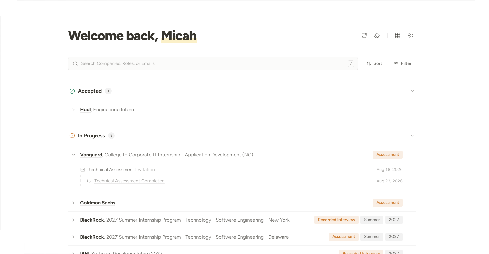

<h1 align="center">Application Tracker</h1>

<p align="center">
  A local board that reads your Gmail and works out which applications you have open.
</p>

<p align="center">
  
</p>

It runs on your machine at <http://127.0.0.1:3939>. Nothing leaves it but the Gmail API and
whichever model provider you gave a key to.

## Running It

Double click **`start.bat`**. It installs what is missing, migrates, builds, serves, and opens your
browser. For development, run `npm run dev`.

The first launch takes a minute or two. Later ones open straight away.

Two things not to change:

- **The address.** The server binds to `127.0.0.1`. It has no login, so on `0.0.0.0` anyone on your
  network could read your inbox.
- **The Prisma version.** Version 7 drops the built in query engine for a driver adapter, which on
  SQLite means compiling `better-sqlite3`. Avoiding that compile is why Prisma was chosen.

## Setup

Three things, once. The Google part takes about fifteen minutes.

### 1. The Secret File

`.env.local` already exists, holding a fresh `APP_SECRET`. It is gitignored.

Back it up. Without it the saved API key cannot be decrypted, though the fix is only to paste the
key in again.

### 2. A Google OAuth Client

Google only reads a Gmail inbox for an app registered as a project you own. These steps make that
registration. Nothing in it is published or reviewed, and you are its only user.

Consent screen setup lives under **Google Auth Platform**. Older guides call the same pages
*APIs & Services > OAuth consent screen*.

1. **Create the project.** [Google Cloud Console](https://console.cloud.google.com/) > project
   picker > **New project**. Name it anything.

   Check the picker now shows it. Configuring the wrong project is the usual way this goes sideways.

2. **Enable the Gmail API.**
   ☰ > **APIs & Services** > **Library** > **Gmail API** > **Enable**.

   Skip this and sign in still works, while every sync fails with
   `Gmail API has not been used in project`.

3. **Set up the consent screen.**
   ☰ > **Google Auth Platform** > **Branding** > **Get started**.

   Give an app name and your email, choose **Audience: External**, add your email again for
   contacts, agree, then **Create**. Internal is only for a Workspace organisation.

4. **Add the Gmail scope.**
   **Data access** > **Add or remove scopes** > **Manually add scopes**.

   Paste `https://www.googleapis.com/auth/gmail.readonly`, then **Add to table**, tick it,
   **Update**, **Save**.

   `gmail.readonly` is restricted, so it usually will not appear in the table on its own. It should
   end up your only restricted scope. The sign in basics need no adding. Nothing here can send,
   delete, or alter mail.

5. **Publish the app.** **Audience** > **Publish app**.

   **Do not skip this.** While an external app sits in Testing, Google expires its refresh token
   after seven days, so the app quietly stops reading your mail every week.

   Publishing submits nothing for review. The app stays unverified, which costs one "Google hasn't
   verified this app" screen and a cap of 100 users. Verifying a restricted scope means a third
   party security assessment, which costs months and real money.

6. **Create the client.** **Clients** > **Create client** > **Web application**. Under
   **Authorized redirect URIs** paste this exactly, then copy the ID and secret:

   ```
   http://127.0.0.1:3939/api/auth/google/callback
   ```

   Exactly means `http` not `https`, `127.0.0.1` not `localhost` (different origins to Google),
   port 3939, and no trailing slash. One character off ends sign in at `redirect_uri_mismatch`.

7. **Fill in `.env.local`.** Then restart the app, since the file is only read at boot:

   ```
   GOOGLE_CLIENT_ID="1234567890-abcdefg.apps.googleusercontent.com"
   GOOGLE_CLIENT_SECRET="GOCSPX-…"
   GOOGLE_REDIRECT_URI="http://127.0.0.1:3939/api/auth/google/callback"
   ```

   Moving off port 3939 means changing four places: this file, the redirect URI in step 6, the
   `dev` and `start` scripts, and the URL `start.bat` opens. Sign in breaks the moment two disagree.

8. **Sign in.** Settings > **Sign in** > pick the account > **Advanced**, then
   **Go to {your app} (unsafe)**, which means unreviewed by Google rather than unsafe to you.

   **Tick the Gmail checkbox** before Continue. Google lets you approve sign in while declining the
   mail scope, which leaves the app looking connected and failing every sync.

### 3. Settings

Fill in three fields:

- **Gmail Account.** Sign in, as above.
- **API Key.** From OpenRouter, Anthropic, or Gemini. Nothing else to choose: the provider is read
  off the key prefix (`sk-or-`, `sk-ant-`, `AIza`), and each ships with one model.
- **Read Emails From.** A start date, capped at 12 months back.

**Check** calls the provider's model list, which is free, and confirms the key works and the model
exists.

Save, and the first sync starts. It reads roughly 250 emails, takes a few minutes, and costs about
20 cents. Every sync after that reads only what is new.

Logging out clears the saved key with the account. Downloaded emails and their classifications
survive, so signing back in does not pay for that first sync twice.

## What Each Provider Costs

Each provider ships with one model, priced per million tokens:

| Provider | Model | Input | Output |
|---|---|---|---|
| OpenRouter | `google/gemini-3.7-flash` | $0.375 | $1.875 |
| Anthropic | `claude-haiku-4-5` | $1.00 | $5.00 |
| Gemini | `gemini-3.7-flash` | $0.75 | $3.75 |

Settings shows the running total for all time and never resets it. Where a provider reports the real
cost, as OpenRouter does, that figure replaces the estimate.

## When Sign In Goes Wrong

| Symptom | Cause | Fix |
|---|---|---|
| Sign in fails with `redirect_uri_mismatch`. | The console URI does not exactly match the one the app sent. | Redo step 6. The culprit is usually `localhost` instead of `127.0.0.1`, a trailing slash, or the wrong port. |
| Sign in fails with `invalid_client`, or says the OAuth client was not found. | The ID or secret is wrong, or belongs to another project. | Re-copy both from the Clients page, then restart the app. |
| Sign in fails with `access_denied`. | You closed the consent screen, or you are not a test user on an app still in Testing. | Publish the app in step 5, or add yourself under **Audience > Test users**. |
| A sync fails with `Gmail API has not been used in project …`. | The API was never enabled. | Redo step 2, then wait a minute. |
| A sync fails with a 403, `Request had insufficient authentication scopes`. | The Gmail checkbox was left unticked at consent. | Settings > **Log out**, then sign in again and tick it. This also clears the saved API key, so have it ready. |
| The board keeps showing **Reconnect Gmail**. | The refresh token was rejected. | Sign in again. Google rejects the token after revoked access, a password change, six months idle, or an app left in Testing. |
| Settings says to add `GOOGLE_CLIENT_ID` and `GOOGLE_CLIENT_SECRET` to `.env.local`. | `.env.local` changed while the server was running, or its values are empty. | Save the file and restart the app. |

To revoke access entirely, use your
[Google account's third party access page](https://myaccount.google.com/connections). It holds
nothing you cannot take back.
